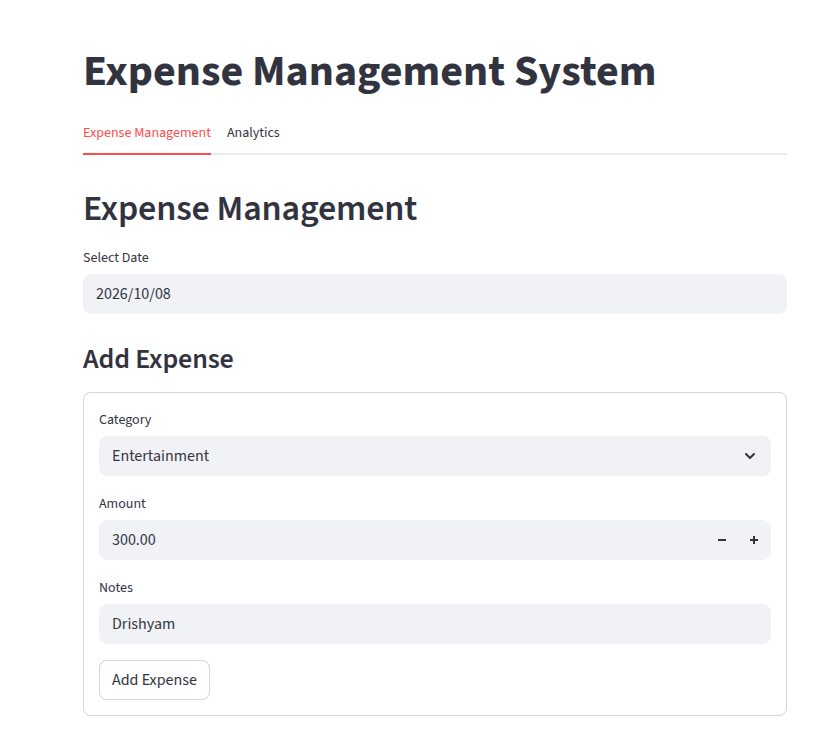
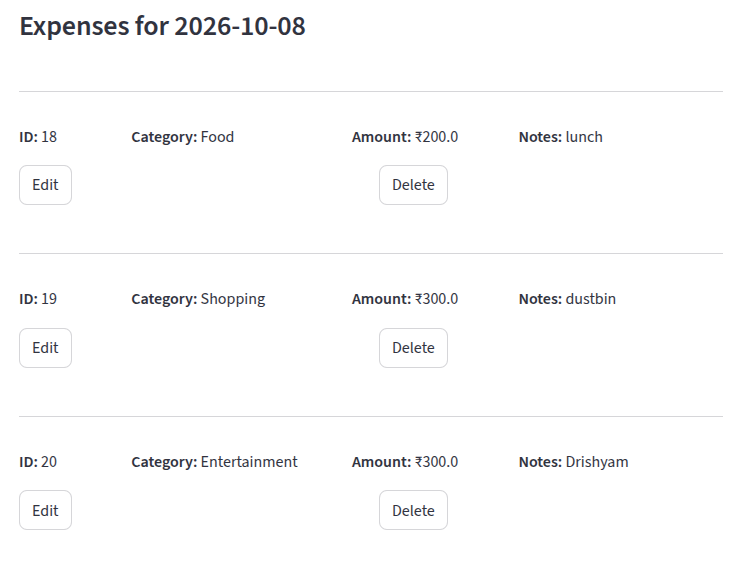
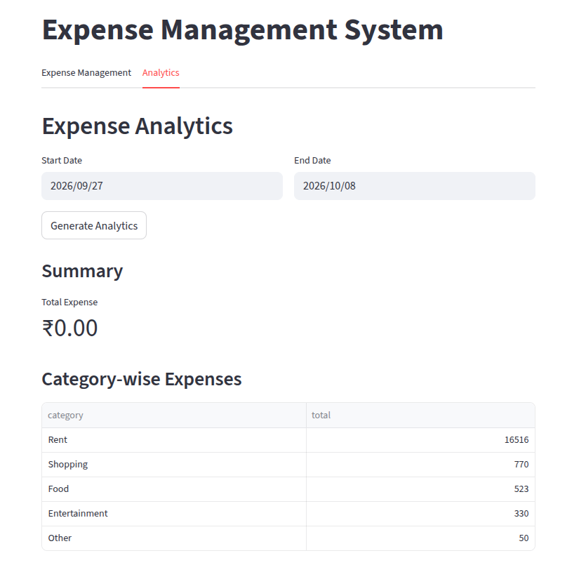
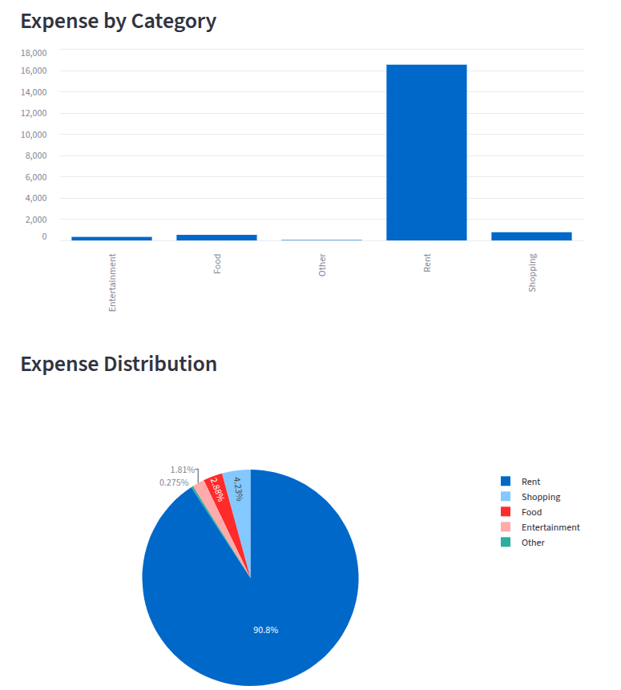

# Expense Management System

A full-stack **Expense Management System** built with **Python, FastAPI, MySQL, and Streamlit**.

The application allows users to:

- Add daily expenses
- View expenses for a selected date
- Edit existing expenses
- Delete expenses
- Store expense records in a MySQL database
- Generate expense analytics for a selected date range
- View category-wise expense summaries
- Visualize expenses using tables and charts
- Analyze daily and monthly spending trends

The project follows a simple architecture in which **Streamlit acts as the frontend**, **FastAPI provides the REST API**, and **MySQL stores the expense data**.

---

## Project Architecture

```text
                 ┌──────────────────────┐
                 │      Streamlit       │
                 │      Frontend       │
                 │                      │
                 │ Expense Management   │
                 │ Analytics Dashboard  │
                 └──────────┬───────────┘
                            │
                            │ HTTP Requests
                            ▼
                 ┌──────────────────────┐
                 │       FastAPI        │
                 │      REST API        │
                 │                      │
                 │ GET /expenses/{date} │
                 │ POST /expenses       │
                 │ PUT /expenses/{id}   │
                 │ DELETE /expenses/{id}│
                 │ POST /analytics/     │
                 └──────────┬───────────┘
                            │
                            │ SQL Queries
                            ▼
                 ┌──────────────────────┐
                 │        MySQL         │
                 │      mydatabase      │
                 │                      │
                 │      expenses        │
                 │       table          │
                 └──────────────────────┘
```

---

## Features

### 1. Expense Management

The application provides a complete CRUD workflow.

#### Add Expense

Users can enter:

- Expense date
- Category
- Amount
- Notes

Available categories:

```text
Food
Rent
Shopping
Entertainment
Other
```

The expense is sent from Streamlit to FastAPI using a `POST` request and stored in MySQL.

---

### 2. View Expenses

Users can select a date and retrieve all expenses recorded for that date.

The application displays:

- Expense ID
- Category
- Amount
- Notes

The frontend communicates with:

```text
GET /expenses/{expense_date}
```

Example:

```text
GET /expenses/2026-10-06
```

---

### 3. Update Expense

Existing expenses can be edited from the Streamlit interface.

The application sends the updated information to:

```text
PUT /expenses/{expense_id}
```

Example:

```text
PUT /expenses/5
```

---

### 4. Delete Expense

Expenses can be deleted using:

```text
DELETE /expenses/{expense_id}
```

Example:

```text
DELETE /expenses/5
```

---

## Analytics Dashboard

The application provides analytics for a selected date range.

For example:

```text
Start Date: 2026-01-01
End Date:   2026-10-06
```

The Streamlit application sends the request to:

```text
POST /analytics/
```

with:

```json
{
    "start_date": "2026-01-01",
    "end_date": "2026-10-06"
}
```

### Analytics currently generated

#### Overall Summary

The backend calculates:

- Total expense
- Average expense
- Number of transactions
- Highest expense

#### Category-wise Analysis

Expenses are grouped by category.

Example:

```text
Food           ₹8,500
Rent          ₹12,000
Shopping       ₹4,200
Entertainment  ₹2,000
Other          ₹1,500
```

The dashboard presents the category data as:

- Table
- Bar chart
- Pie chart

#### Daily Expense Analysis

Expenses are grouped by date.

The dashboard presents:

- Daily expense table
- Daily expense trend using a line chart

#### Monthly Expense Analysis

Expenses are grouped by month using:

```sql
DATE_FORMAT(expense_date, '%Y-%m')
```

This provides monthly spending totals for the selected period.

#### Top Expense Category

The backend identifies the category with the highest total expenditure in the selected date range.

---

# Technology Stack

| Component | Technology |
|---|---|
| Frontend | Streamlit |
| Backend | FastAPI |
| Database | MySQL |
| API Communication | REST / HTTP |
| Data Processing | Pandas |
| Visualization | Streamlit Charts / Plotly |
| Validation | Pydantic |
| Database Driver | MySQL Connector |
| Server | Uvicorn |
| Language | Python |

---

# Project Structure

A recommended project structure is:

```text
expense-management-system/
│
├── frontend/
│   └── streamlit_app.py
│
├── backend/
│   ├── main.py
│   ├── crud.py
│   └── logger.py
│
├── requirements.txt
├── README.md
└── .gitignore
```

If your current files are in one directory, the same modules can also be kept together:

```text
expense-management-system/
│
├── main.py
├── crud.py
├── logger.py
├── streamlit_app.py
├── requirements.txt
├── README.md
└── .gitignore
```

The important requirement is that the imports such as:

```python
from crud import ...
from logger import setup_logger
```

resolve correctly from your project structure.

---

# Database Setup

The application automatically creates the database:

```text
mydatabase
```

if it does not already exist.

It also automatically creates the table:

```text
expenses
```

with the following structure:

```sql
CREATE TABLE expenses (
    id INT PRIMARY KEY AUTO_INCREMENT,
    expense_date DATE,
    amount FLOAT,
    category VARCHAR(255),
    notes TEXT
);
```

The database connection in the current code is:

```python
host='localhost'
user='krishnendu'
password='test123'
database='mydatabase'
```

Before running the application, make sure MySQL is installed and running.

You should also ensure that the MySQL user has permission to create/access the database.

> **Security note:** For a real deployment, do not store database passwords directly in Python source code. Use environment variables or a `.env` file.

---

# Installation

## 1. Clone the repository

```bash
git clone https://github.com/<your-username>/expense-management-system.git
cd expense-management-system
```

Replace `<your-username>` with your GitHub username.

---

## 2. Create a virtual environment

```bash
python3 -m venv venv
```

Activate it on Linux/macOS:

```bash
source venv/bin/activate
```

On Windows:

```powershell
venv\Scripts\activate
```

---

## 3. Install dependencies

```bash
pip install -r requirements.txt
```

---

# Running the Application

The application consists of two services:

1. FastAPI backend
2. Streamlit frontend

Both need to be running.

---

## Start FastAPI

From the backend/project directory:

```bash
uvicorn main:app --reload
```

The API will normally be available at:

```text
http://localhost:8000
```

FastAPI's interactive API documentation is available at:

```text
http://localhost:8000/docs
```

You can use the Swagger UI to test the API endpoints.

---

## Start Streamlit

In another terminal:

```bash
streamlit run streamlit_app.py
```

Streamlit will normally open at:

```text
http://localhost:8501
```

The Streamlit frontend communicates with:

```text
http://localhost:8000
```

as defined by:

```python
API_URL = "http://localhost:8000"
```

---

# API Endpoints

## Get expenses for a date

```http
GET /expenses/{expense_date}
```

Example:

```text
GET /expenses/2026-10-06
```

---

## Add an expense

```http
POST /expenses
```

Request body:

```json
{
    "expense_date": "2026-10-06",
    "category": "Food",
    "amount": 250,
    "notes": "Lunch"
}
```

---

## Update an expense

```http
PUT /expenses/{expense_id}
```

Request body:

```json
{
    "expense_date": "2026-10-06",
    "category": "Food",
    "amount": 300,
    "notes": "Updated lunch expense"
}
```

---

## Delete an expense

```http
DELETE /expenses/{expense_id}
```

Example:

```text
DELETE /expenses/5
```

---

## Generate analytics

```http
POST /analytics/
```

Request:

```json
{
    "start_date": "2026-01-01",
    "end_date": "2026-10-06"
}
```

The endpoint returns summary, category-wise, daily, and monthly analytics.

---

# Example API Response

The analytics endpoint returns data in the following general structure:

```json
{
    "summary": {
        "total_expense": 28500,
        "average_expense": 950,
        "transaction_count": 30,
        "highest_expense": 12000
    },
    "top_category": "Rent",
    "category_summary": [
        {
            "category": "Rent",
            "total": 12000
        },
        {
            "category": "Food",
            "total": 8500
        }
    ],
    "daily_summary": [
        {
            "expense_date": "2026-10-01",
            "total": 750
        }
    ],
    "monthly_summary": [
        {
            "month": "2026-10",
            "total": 28500
        }
    ]
}
```

---

# Database Schema

The application uses a single table:

```text
expenses
```

| Column | Type | Description |
|---|---|---|
| id | INT | Primary key |
| expense_date | DATE | Date of expense |
| amount | FLOAT | Expense amount |
| category | VARCHAR(255) | Expense category |
| notes | TEXT | Additional information |

---

# Example Workflow

A typical workflow is:

```text
User enters expense
        ↓
Streamlit frontend
        ↓
POST /expenses
        ↓
FastAPI
        ↓
CRUD function
        ↓
MySQL
        ↓
Expense stored
```

For analytics:

```text
User selects date range
        ↓
Streamlit
        ↓
POST /analytics/
        ↓
FastAPI
        ↓
SQL aggregation queries
        ↓
Analytics result
        ↓
Streamlit tables + charts
```

---

# Requirements

The project dependencies are listed in:

```text
requirements.txt
```

Install them using:

```bash
pip install -r requirements.txt
```

---

# Screenshots

Add screenshots of the application here.

```text
images/
├── expense-management.png
└── analytics.png
```








---

# Learning Outcomes

This project demonstrates practical experience with:

- Python backend development
- REST API development
- FastAPI
- Pydantic data validation
- MySQL database management
- SQL aggregation queries
- CRUD operations
- HTTP communication between frontend and backend
- Streamlit application development
- Pandas data analysis
- Data visualization
- Full-stack Python application architecture

---

# Author

**Krishnendu Patra**

Computational Physics / Data Science / Machine Learning

GitHub: `https://github.com/kririntu`
